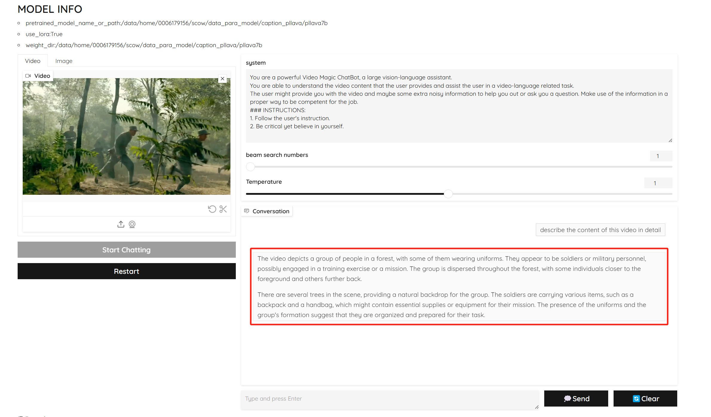

<div align="center">

<h2><a href="https://pllava.github.io/">PLLaVA-NPU: Adapt PLLaVA program to run on NPU</a></h2>

Tiange Zhang, Rongqun Lin, Chuanmin Jia, Siwei Ma

Peking University, Pengcheng Laboratory

</div>

<!-- [](https://arxiv.org/abs/2311.17005) -->

**Project Page: [PLLaVA-NPU](https://github.com/SunnyMass/PLLaVA-NPU.git)**


### 工作简述
本项目旨在将多模态视频理解模型 **PLLaVA** 适配至华为昇腾910B 芯片平台，实现其在 NPU 上的完整推理流程与部署支持。PLLaVA 为通用型多模态大模型，支持多种视频理解任务，如视频问答（VideoQA）与视频字幕生成（Video Captioning），其核心依赖包括 3D 池化算子和 `decord` 视频读取模块，均无法在昇腾 NPU 上直接运行，需进行底层模块重构与兼容性适配。

本项目基于 PLLaVA 官方开源代码完成适配与优化，主要包括：

- ✅ 重写 3D 池化模块等脚本以适配 NPU 运算；
- ✅ 使用 `cv2` 替代 `decord`，完成视频帧的读取与预处理；
- ✅ 支持 Gradio 网页端部署及命令行调用方式；
- ✅ 为视频caption任务提供了更丰富的聊天背景设定，给定示例指导生成更优结果。

此外，我们还对比了选择 4 帧、16 帧等输入配置。结果表明，采用 16 帧方案在语义质量与响应时间之间达到较好平衡。最后，在 GPU 平台进行对照测试，结果显示语义输出一致，其中3D池化模块的输入和输出均保持一致。

目前项目代码已整理完成并开源，支持 NPU 平台运行 PLLaVA 通用 chat 模型的视频理解任务。欢迎在此基础上继续优化运行效率，拓展更多模态应用场景。

### 实验结果
**测试视频输入：**


**运行命令：**
```
python run_demo.py   --video_path path_to_1-2.mp4   --prompt "describe this video in detail"   --pretrained_model_name_or_path path_to_pllava7b   --weight_dir path_to_pllava7b   --use_lora   --num_frames 16   --conv_mode plain   --max_new_tokens 128  --video_caption(如果是做视频caption任务就加上，如果是其他视频理解任务就不加)
```
如果需要部署gradio
```
sh ./scripts/demo.sh
```
可以在PLLaVA/tasks/eval/demo/pllava_demo.py文件末尾定义url地址。
```
demo.launch(
    server_name="0.0.0.0",
    server_port=10034,
    root_path="/ai/api/proxy/ascend-k8s/relative/master/30003/proxy/10034"
)
```

**NPU输出结果：（重写3D池化算子）**
```
The image depicts a group of men in a wooded area, with some of them carrying guns. They are walking through the forest, possibly engaging in a hunting activity or a military exercise. The men are spread out across the scene, with some closer to the foreground and others further back. The presence of the guns suggests that they are prepared for a potential threat or are participating in a training exercise. The overall atmosphere of the image is one of camaraderie and readiness.
```

**GPU输出结果：（支持AdaptiveAvgPool3d算子）**
```
The image depicts a group of men in a wooded area, with some of them carrying guns. They are walking through the forest, possibly on a mission or engaging in a training exercise. The men are spread out, with some closer to the front and others further back in the scene. The presence of the guns suggests that they might be prepared for a potential threat or are participating in a military or law enforcement operation.
```
### 重写3D池化算子
**原始代码问题分析：**
RuntimeError: adaptive_avg_pool3d only support D=1 && H=1 && W=1 current!该问题指出，NPU不支持3D池化，即不支持torch._C._nn.adaptive_avg_pool3d自适应尺寸。如果解决这种报错，必须要修改尺寸，这会导致模型推理时，出现错误的映射并无法对齐，从而导致幻觉等问题出现。如果改成2D池化或者用其他方式表征时域，都无法改善这种幻觉问题，而在GPU上推理能得到准确结果。因此需要从本质上解决这个3D池化函数适配问题。
AdaptiveAvgPool3d((T_out, H_out, W_out)) 表示：在三维空间（时间 + 空间）上，自动将每段 video（形状 [C, T, H, W]）平均池化到指定形状 [C, T_out, H_out, W_out]。如果输入是 [B, C, T=8, H=14, W=14]，设置 --pooling_shape 4-12-12，就会变成：输出形状 = [B, C, 4, 12, 12]，从而稀疏化token个数。

**代码流程：**
线性映射 vision hidden → text hidden；
转换为 [B, C, T, H, W]；
用 3D池化（时间+空间）降低 token 数；
flatten 成 [B, N, dim] 供 LLM 接受；
最终用于 generate() 接口输入的 image_features。

**替代解决方案：**
由于 NPU 不支持包括 AdaptiveAvgPool3d 在内的多种 3D 池化算子，因此我们手动实现一个兼容 NPU 的 3D 池化函数，用于在不改变数值语义的前提下，完成时间维度和空间维度的降采样，确保推理过程与 GPU 上一致，避免出现映射错乱或语义幻觉等问题。该函数完全复现了 AdaptiveAvgPool3d 的行为，前提是输入的时间、空间尺寸能整除目标尺寸。适用于大多数实际配置，同时在 NPU 上高效可用，确保视觉特征 token 数在时空维度的稀疏化过程保持一致。


```
def adaptive_avg_pool3d_manual(self, x, output_size):
        """
        x: [B, C, D, H, W]
        output_size: (d_out, h_out, w_out)
        替代 AdaptiveAvgPool3d，NPU 兼容
        """
        B, C, D, H, W = x.shape
        d_out, h_out, w_out = output_size
        print(output_size)
        assert D % d_out == 0 and H % h_out == 0 and W % w_out == 0, "Input size must be divisible by output size"

        kd = D // d_out
        kh = H // h_out
        kw = W // w_out

        # reshape 成 6维：将 D/H/W 分成 avg block 块 + 块内元素
        x = x.view(B, C, d_out, kd, h_out, kh, w_out, kw)  # [B, C, d_out, kd, h_out, kh, w_out, kw]
        x = x.mean(dim=(3, 5, 7))  # 对 kd, kh, kw 三个维度做均值
        return x  # shape [B, C, d_out, h_out, w_out]
```

### 运行脚本
```
import torch
import time
import cv2
from PIL import Image
from argparse import ArgumentParser
import torchvision.transforms as transforms

from tasks.eval.eval_utils import conv_templates, ChatPllava
from tasks.eval.model_utils import load_pllava

SYSTEM = """You are a powerful Video Magic ChatBot, a large vision-language assistant. 
You are able to understand the video content that the user provides and assist the user in a video-language related task.
The user might provide you with the video and maybe some extra noisy information to help you out or ask you a question. Make use of the information in a proper way to be competent for the job.
### INSTRUCTIONS:
1. Follow the user's instruction.
2. Be critical yet believe in yourself.
"""
SYSTEM2 = """
Describe this video. Pay attention to all objects in the video. The description should be useful for AI to re-generate the video. The description should be no more than six sentences. Here are some examples of good descriptions: 1. A stylish woman walks down a Tokyo street filled with warm glowing neon and animated city signage. She wears a black leather jacket, a long red dress, and black boots, and carries a black purse. She wears sunglasses and red lipstick. She walks confidently and casually. The street is damp and reflective, creating a mirror effect of the colorful lights. Many pedestrians walk about. 2. Several giant wooly mammoths approach treading through a snowy meadow, their long wooly fur lightly blows in the wind as they walk, snow covered trees and dramatic snow capped mountains in the distance, mid afternoon light with wispy clouds and a sun high in the distance creates a warm glow, the low camera view is stunning capturing the large furry mammal with beautiful photography, depth of field. 3. Drone view of waves crashing against the rugged cliffs along Big Sur's garay point beach. The crashing blue waters create white-tipped waves, while the golden light of the setting sun illuminates the rocky shore. A small island with a lighthouse sits in the distance, and green shrubbery covers the cliff's edge. The steep drop from the road down to the beach is a dramatic feat, with the cliff’s edges jutting out over the sea. This is a view that captures the raw beauty of the coast and the rugged landscape of the Pacific Coast Highway.
"""

def load_video(video_path, num_segments=4, resolution=336):
    cap = cv2.VideoCapture(video_path)
    total_frames = int(cap.get(cv2.CAP_PROP_FRAME_COUNT))
    indices = [int(i * total_frames / num_segments) for i in range(num_segments)]

    frames = []
    resize = transforms.Resize((resolution, resolution))
    idx = 0
    while True:
        ret, frame = cap.read()
        if not ret:
            break
        if idx in indices:
            frame = cv2.cvtColor(frame, cv2.COLOR_BGR2RGB)
            pil_img = Image.fromarray(frame)
            pil_img = resize(pil_img)
            frames.append(pil_img)
        idx += 1
    cap.release()
    return frames


def parse_args():
    parser = ArgumentParser()
    parser.add_argument('--video_path', type=str, required=True)
    parser.add_argument('--prompt', type=str, required=True)
    parser.add_argument('--num_frames', type=int, default=4)
    parser.add_argument('--pretrained_model_name_or_path', type=str, required=True)
    parser.add_argument('--weight_dir', type=str, default=None)
    parser.add_argument('--use_lora', action='store_true')
    parser.add_argument('--lora_alpha', type=int, default=4)
    parser.add_argument('--conv_mode', type=str, default='plain')
    parser.add_argument('--max_new_tokens', type=int, default=200)
    parser.add_argument('--num_beams', type=int, default=1)
    parser.add_argument('--temperature', type=float, default=1.0)
    parser.add_argument('--video_caption', action='store_true')
    return parser.parse_args()


def main():
    args = parse_args()

    print("📦 Loading model...")
    model, processor = load_pllava(
        repo_id=args.pretrained_model_name_or_path,
        num_frames=args.num_frames,
        use_lora=args.use_lora,
        lora_alpha=args.lora_alpha,
        weight_dir=args.weight_dir,
    )
    model = model.to('npu').eval()
    print(f"Model device: {next(model.parameters()).device}")
    chat = ChatPllava(model, processor)

    print("📽️ Loading video frames...")
    frames = load_video(args.video_path, args.num_frames)
    img_list = [frames]  # 必须是二维列表 [ [PIL, PIL, PIL...] ]

    print("💬 Asking and answering...")
    conv = conv_templates[args.conv_mode].copy()
    if args.video_caption:
        conv = chat.ask(args.prompt, conv, SYSTEM2)
    else:
        conv = chat.ask(args.prompt, conv, SYSTEM)

    start_time = time.time()
    llm_message, _, _ = chat.answer(
        conv=conv,
        img_list=img_list,
        max_new_tokens=args.max_new_tokens,
        num_beams=args.num_beams,
        temperature=args.temperature
    )
    elapsed = time.time() - start_time

    print(f"\n⏱️ Inference took {elapsed:.2f} seconds")
    print("\n===== FINAL ANSWER =====\n")
    print(llm_message.strip())


if __name__ == '__main__':
    main()

```

### 环境配置
当前conda环境配置保存在conda_env_export.txt文件中。
```
name: caption
channels:
  - defaults
  - https://repo.anaconda.com/pkgs/main
  - https://repo.anaconda.com/pkgs/r
dependencies:
  - _libgcc_mutex=0.1=main
  - _openmp_mutex=5.1=51_gnu
  - ca-certificates=2024.11.26=hd43f75c_0
  - ld_impl_linux-aarch64=2.40=h48e3ba3_0
  - libffi=3.4.4=h419075a_1
  - libgcc-ng=11.2.0=h1234567_1
  - libgomp=11.2.0=h1234567_1
  - libstdcxx-ng=11.2.0=h1234567_1
  - ncurses=6.4=h419075a_0
  - openssl=3.0.15=h998d150_0
  - pip=24.2=py39hd43f75c_0
  - python=3.9.20=h4bb2201_1
  - readline=8.2=h998d150_0
  - setuptools=75.1.0=py39hd43f75c_0
  - sqlite=3.45.3=h998d150_0
  - tk=8.6.14=h987d8db_0
  - wheel=0.44.0=py39hd43f75c_0
  - xz=5.4.6=h998d150_1
  - zlib=1.2.13=h998d150_1
  - pip:
      - accelerate==1.6.0
      - aiofiles==23.2.1
      - albucore==0.0.23
      - albumentations==1.4.24
      - annotated-types==0.7.0
      - antlr4-python3-runtime==4.9.3
      - anyio==4.9.0
      - asttokens==3.0.0
      - astunparse==1.6.3
      - attrs==24.2.0
      - av==14.0.1
      - beautifulsoup4==4.12.3
      - bs4==0.0.2
      - certifi==2024.8.30
      - charset-normalizer==3.4.0
      - click==8.1.8
      - contourpy==1.3.0
      - cycler==0.12.1
      - decorator==5.1.1
      - distro==1.9.0
      - einops==0.8.0
      - eval-type-backport==0.2.2
      - exceptiongroup==1.2.2
      - fastapi==0.115.12
      - ffmpy==0.5.0
      - filelock==3.16.1
      - fonttools==4.57.0
      - fsspec==2024.10.0
      - ftfy==6.3.1
      - gradio==4.44.1
      - gradio-client==1.3.0
      - h11==0.14.0
      - httpcore==1.0.7
      - httpx==0.28.1
      - huggingface-hub==0.30.1
      - idna==3.10
      - imageio==2.36.1
      - imageio-ffmpeg==0.6.0
      - imagesize==1.4.1
      - importlib-resources==6.5.2
      - jinja2==3.1.4
      - jiter==0.9.0
      - kiwisolver==1.4.7
      - lazy-loader==0.4
      - markdown-it-py==3.0.0
      - markupsafe==2.1.5
      - matplotlib==3.9.4
      - mdurl==0.1.2
      - mindcv==0.3.0
      - mindspore==2.3.1
      - moviepy==2.1.2
      - mpmath==1.3.0
      - networkx==3.2.1
      - numpy==1.26.4
      - omegaconf==2.3.0
      - openai==1.72.0
      - opencv-python==4.10.0.84
      - opencv-python-headless==4.10.0.84
      - orjson==3.10.16
      - packaging==24.2
      - pandas==2.2.3
      - peft==0.15.1
      - pillow==10.4.0
      - proglog==0.1.11
      - protobuf==5.29.2
      - psutil==6.0.0
      - pydantic==2.10.4
      - pydantic-core==2.27.2
      - pydub==0.25.1
      - pygments==2.19.1
      - pyparsing==3.2.3
      - python-dateutil==2.9.0.post0
      - python-dotenv==1.1.0
      - python-multipart==0.0.20
      - pytz==2024.2
      - pyvideoreader==0.5.7
      - pyyaml==6.0.2
      - regex==2024.11.6
      - requests==2.32.3
      - rich==14.0.0
      - ruff==0.11.4
      - safetensors==0.4.5
      - scikit-image==0.24.0
      - scipy==1.13.1
      - semantic-version==2.10.0
      - sentencepiece==0.2.0
      - shellingham==1.5.4
      - simsimd==6.2.1
      - six==1.17.0
      - sniffio==1.3.1
      - soupsieve==2.6
      - starlette==0.46.1
      - stringzilla==3.11.3
      - svgwrite==1.4.3
      - sympy==1.13.1
      - tifffile==2024.8.30
      - tokenizers==0.21.1
      - tomlkit==0.12.0
      - toolz==1.0.0
      - torch==2.3.1
      - torch-npu==2.3.1
      - torchaudio==0.13.1
      - torchvision==0.14.1
      - tqdm==4.67.1
      - transformers==4.51.0
      - typer==0.15.2
      - typing-extensions==4.12.2
      - tzdata==2024.2
      - urllib3==2.2.3
      - uvicorn==0.34.0
      - wcwidth==0.2.13
      - websockets==12.0
      - zipp==3.21.0
prefix: /root/software/miniconda3/envs/caption

```

### 项目结构
```
.
├── 1-2.mp4
├── assert
│   ├── data.png
│   ├── gradio.png
│   ├── logo.png
│   ├── module.png
│   ├── performance.png
│   ├── teaser.jpg
│   └── zeroshot.png
├── conda_env_export.txt
├── DATA.md
├── dataset
│   ├── base_dataset.py
│   ├── __init__.py
│   ├── it_dataset.py
│   ├── utils.py
│   └── video_utils.py
├── docs
│   └── PoolLLaVA_Report.pdf
├── example
│   ├── 1917.mov
│   ├── 1917.mp4
│   ├── bear.jpg
│   ├── cooking.mp4
│   ├── dog.png
│   ├── jesse_dance.mp4
│   ├── working.mp4
│   └── yoga.mp4
├── fusion_result.json
├── models
│   ├── __init__.py
│   ├── pllava
│   └── __pycache__
├── python_scripts
│   └── hf.py
├── README.md
├── requirements.no_torch.txt
├── requirements.torch.txt
├── requirements.txt
├── run_demo.py
├── scripts
│   ├── accel_config_deepspeed_zero2.yaml
│   ├── accel_config_deepspeed_zero3_offload_multinode_1.yaml
│   ├── accel_config_deepspeed_zero3_offload_multinode_2.yaml
│   ├── accel_config_deepspeed_zero3_offload_multinode.yaml
│   ├── accel_config_deepspeed_zero3_offload_singlegpu.yaml
│   ├── accel_config_deepspeed_zero3_offload.yaml
│   ├── accel_config_multigpu.yaml
│   ├── accel_config_multinode.yaml
│   ├── accel_config_singlegpu.yaml
│   ├── demo.sh
│   ├── eval.sh
│   ├── eval_yiprompt.sh
│   ├── gallery.sh
│   ├── train_pllava_13b.sh
│   ├── train_pllava_34b.sh
│   ├── train_pllava_7b.sh
│   └── train_pllava.sh
├── structure.txt
├── tasks
│   ├── eval
│   ├── shared_utils.py
│   └── train
└── utils
    ├── basic_utils.py
    ├── config.py
    ├── config_utils.py
    ├── distributed.py
    ├── easydict.py
    ├── logger.py
    ├── optimizer.py
    ├── __pycache__
    └── scheduler.py

15 directories, 59 files

```
